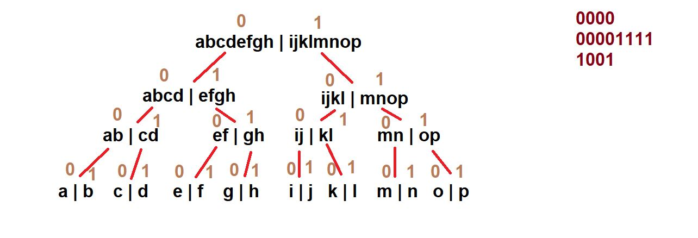

### Encode String

#### Task: Decode the encoded string

<b>Explanation: </b>How the word is encoded,

For example, the letter ```j``` would be encoded as :

- Among ```(a,b,c,d,e,f,g,h | i,j,k,l,m,n,o,p)```, ```j``` appears in the second half. So the first bit of its encoding is ```1```.
- Now, among ```(i,j,k,l | m,n,o,p)```, ```j``` appears in the first half. So the second bit of its encoding is ```0```.
- Now, among ```(i,j | k,l)```, ```j``` appears in the first half. So the third bit of its encoding is ```0```.
- Now, among ```(i | j)```, ```j``` appears in the second half. So the fourth and last bit of its encoding is ```1```.

So ```j's``` encoding is ```1001```,



___

### Fair Elections

### Task: 
There are two persons who are appearig for election John Jackson(having N votes) and Jack Johnson(having M votes)
You are the friend of John Jackson and you want to help him by winnig the election by swapping minimum number of votes between the two of them.
And if it is impossible to make John Jackson win return -1.

#### Input
- The first line of the input contains a single integer T denoting the number of test cases. The description of T test cases follows.
- The first line of each test case contains two space-separated integers N and M.
- The second line contains N space-separated integers A1,A2,…,AN.
- The third line contains M space-separated integers B1,B2,…,BM.

#### Example Input:
2
2 3
2 2
5 5 5
4 3
1 3 2 4
6 7 8

#### Example Output:
2
1

#### Explanation:
<b>Example case 1: </b>We can perform two swaps ― each time, we swap a pack of 2 votes from A and a pack of 5 votes from B. After that, John Jackson gets 5+5=10 votes and Jack Johnson gets 2+2+5=9 votes.

<b>Example case 2: </b>We can swap the pack of 1 vote from A and the pack of 8 votes from B. After that, John Jackson gets 8+3+2+4=17 votes and Jack Johnson gets 6+7+1=14 votes.